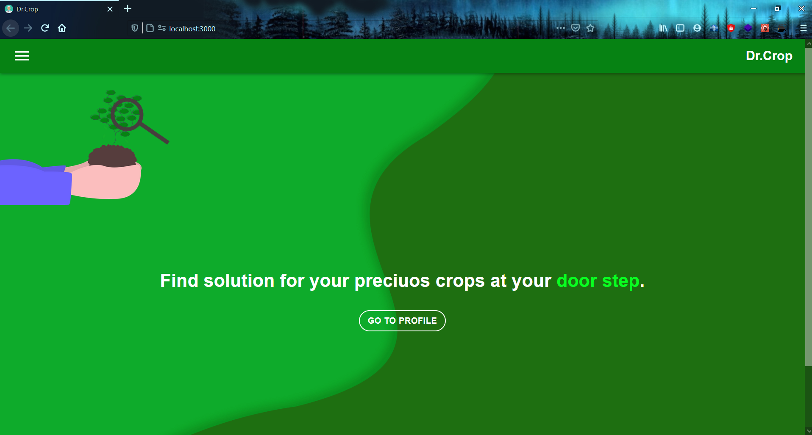
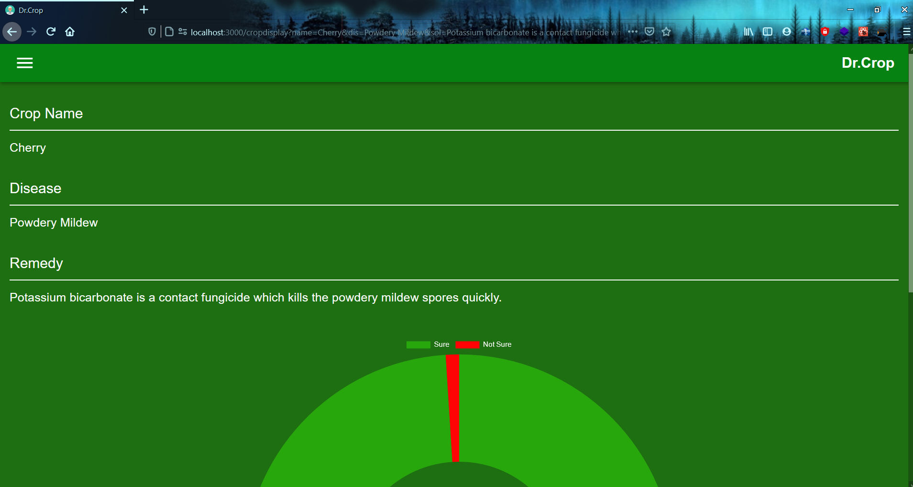
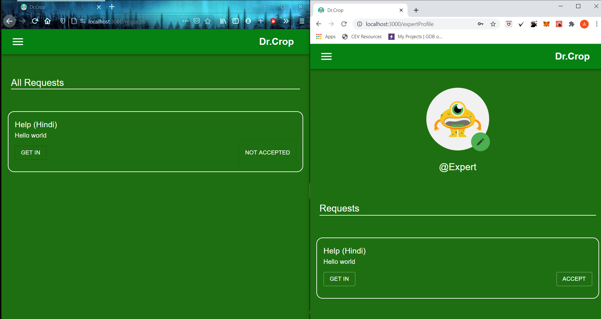

# DR_CROP
  by **TEAM S.A.Y.**

## UN GOAL:- ZERO HUNGER

- Dr. Crop is a crop disease detection software working on a deep learning model based on computer vision currently deployed on Google Cloud.
- User would input crop name and add its images to the application. The ML model would detect the disease from image would return disease name and its remedy to the User.
- Further It provides system where user could interact with experts in field of agriculture using chat feature.

   
  
  
  
  

## PROBLEMS SOLVED:

- Helping lower and middle income farmers with disease detection and help them prevent this diseases.
- Help them increasing their Crop productivity and also increasing their income giving boost to the lifeline of nation.
- Creating a new front of Employment on Experts in field of agriculture as demands of experts would increase.

## FUTURE SCOPE:

- As More crops would be added large range and variety of crop diseases would be covered.
- Language suport for different languages could also be added.

## MADE BY:
  - Ashutosh Thakur
  - Yash Wandhare
  - Saksham Gupta
